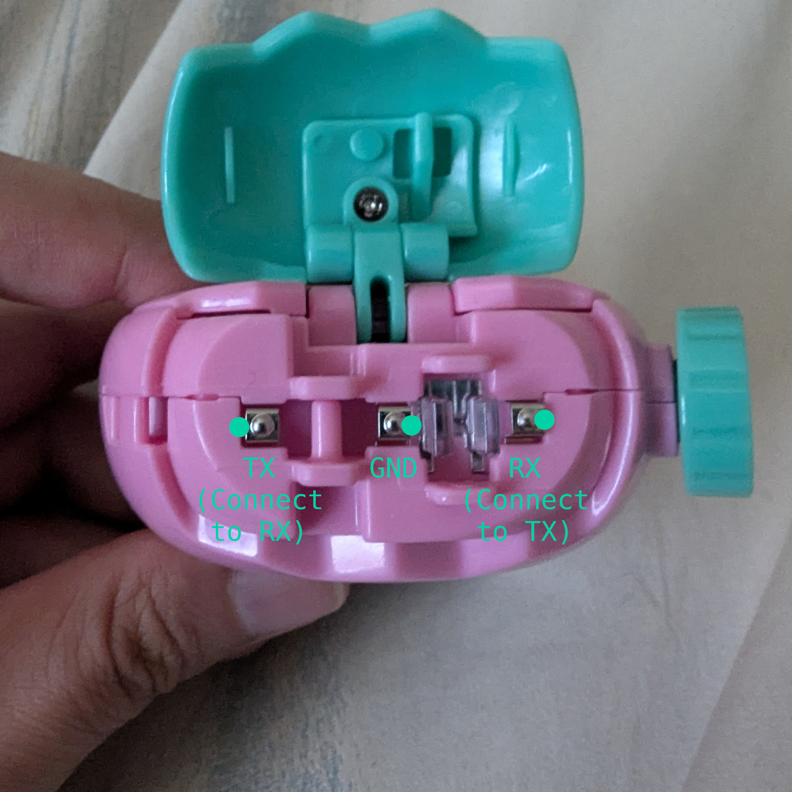

Connecting with the prongs on Tamagotchi Paradise
=================================================

Tamagotchi Paradise uses UART to communicate, meaning you can use almost any
old UART adapter to connect it to a computer.

Basic requirements:
- A UART adapter supporting 3.3V logic and at least 460800 baud speed.
- A way to connect to the prongs. This could be as simple as dupont wires that
  you jam into the gap on the side of the prongs, to 3D-printed docks.

UART adapter
------------

Nothing fancy is needed, just something that supports 3.3V logic and 460800
baud. Some chips that are known compatible are CH340C and CP2102. If you have
a CH341 or CH347 flash programmer, you can also use them provided you put it
in the correct mode (for the typical CH341 programmer, move the jumper from 1-2
to 2-3).

Personally I use [this](https://www.sparkfun.com/sparkfun-serial-basic-breakout-ch340c-and-usb-c.html),
but any old UART adapter should work. If you are using a blue CP2102 module where
it has a micro-USB connector on the circuit board, and holes for signal lines
on the other end, be careful to measure the voltage between the TX line and GND
to verify that it is at the correct voltage. Some of these boards are
incorrectly wired for higher than 3.3V. Similarly, if you are using a CH341
programmer, check the voltage between TX and GND to make sure it's 3.3V,
because some of these are similarly miswired for constant 5V.

It is not recommended to use any device that does not present itself as a
standard UART adapter, as these may use proprietary protocols and will not be
(instantly) compatible with any mods that don't use the TCP protocol.

Connector
---------

Ideally the connector you use is similar to what's on the Paradise, but it's
not readily accessible. So the next best thing is a dock designed for the
Paradise. One such dock has been designed by joushiikuta, and you can find it
[here](https://www.thingiverse.com/thing:7122620). Pick the correct file for
the connector bits that you want to use.

If you do not have a 3D printer, you can still improvise. I currently use plain
old dupont wires. You need male pins for the Tamagotchi side, and either male
or female connection on the UART adapter side, depending on what you have.

Although you can use crocodile clips or test clips, those are not recommended
since they can deform or scratch the prongs.

The left prong is TX, middle prong is GND, and right prong is RX. When
connecting to your UART adapter, make sure to swap TX and RX. That is, the left
prong should be connected to where your adapter has labelled RX, and the right
prong should be connected to where your adapter has labelled TX. Remember to
also connect GND.

In the following photo you can see where to poke wires at.

Software
--------

There is currently no known end-user software that has been released and works
with standard UART adapters. Maybe wait a while for people to work on stuff.
